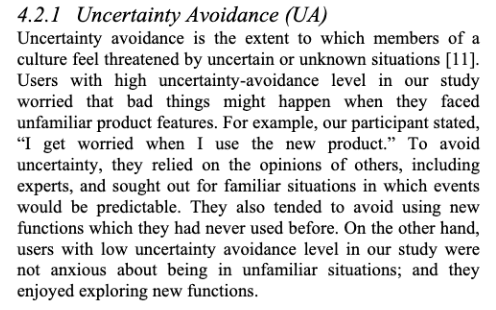
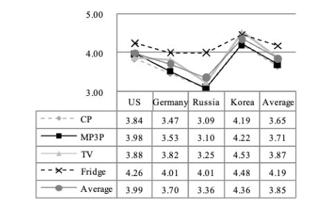
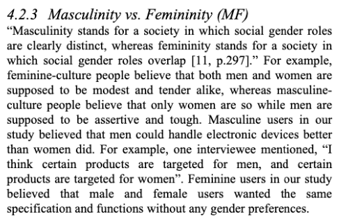
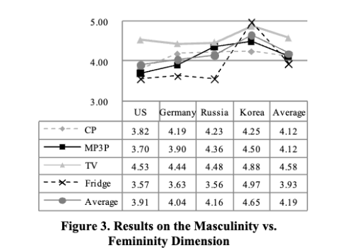
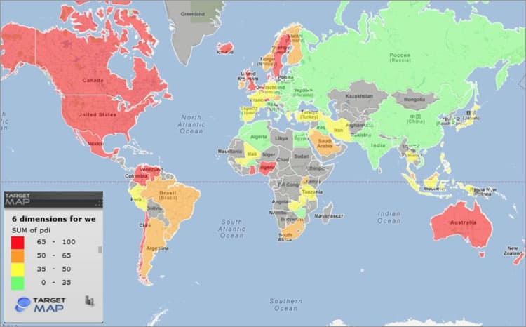

이 글은 [Cultural Dimensions for User Expericnce: Cross-Country and Cross-Product Analysis of Users' Cultural Characteristics](https://www.scienceopen.com/hosted-document?doi=10.14236/ewic/HCI2008.1) 논문을 참고하여 작성하였습니다.

## 서론

프론트엔드 개발자로서, 유저의 리텐션을 최대로 이끌어 낼 수 있는 UX에 대해서 고민하곤 합니다. 물론 기본적인 UI/UX 요소는 기획자와 디자이너의 영역이라고 볼 수 있지만, 개발자 또한 본인만의 기준을 가지고 제품에 대한 피드백을 제공하는 것이 성공적인 프로덕트를 개발하는 데 필수적인 요소라고 생각하기 때문입니다.

전인류를 관통하는 "좋은 사용자 경험"을 설계하기 위해서는, 인문학적 접근이 필요하다고 생각합니다. 사용자가 선호하는 근본적인 행동 양식을 이해하고, 그에 따른 기준을 만드는 것을 목표로 하고 있습니다.

논문을 찾아보던 중 흥미로운 연구결과를 찾게 되었는데요, 문화적 차이에 따라 사용자가 선호하는 UX 요소가 다르다는 것입니다. 여기서는 크게 4개의 국가(미주, 독일, 러시아, 한국)를 대상으로 연구가 이루어졌습니다.

이 논문에서는 [Hofstede의 문화 척도](https://ko.wikipedia.org/wiki/%ED%98%B8%ED%94%84%EC%8A%A4%ED%85%8C%EB%8D%94_%EB%AC%B8%ED%99%94_%EC%B0%A8%EC%9B%90_%EC%9D%B4%EB%A1%A0)를 사용하여 문화적 차이를 분석하고 있습니다.
이 논문에 활용된 2가지 척도와, 논문에는 활용되지 않았지만 개인적으로 흥미로웠던 척도 1가지를 소개하고 제 나름대로 분석해보고자 합니다.

## 1. 불확실성 회피 (Uncertainty Avoidance, UA)

### 분석

새로운 문화나 기술을 맞닥뜨렸을 때, 이를 즐기면서 탐구하는 사람이 있는 반면에 이를 걱정하는 사람이 있겠죠. 이 척도를 이르는 말이 불확실성 회피 입니다.

높은 UA를 보이는 국가는 엄격한 신념과 행동 규범을 유지하며, 이단적인 행동과 사상을 잘 받아들이지 못하는 경향을 가지고 있습니다. 반대로, 낮은 UA를 보이는 국가는 원칙보다는 융통성을 지키는 성향을 가지고 있습니다.

도표의 수치에 따르면, 가장 변화를 싫어하는 나라는 한국(4.36)이며, 가장 변화를 즐기는 나라는 러시아(3.36)이네요. 대체적으로 서방 국가들은 변화를 즐기거나, 불확실성에 대한 면역이 높은 것을 알 수 있습니다.

### 제품 적용

따라서, 높은 UA를 보이는 국가에 속한 사용자는 첨단의(?) 디자인과 과하게 자극적인 컨텐츠에 반감을 표할 가능성이 높습니다.

반대로, UA가 약한 문화권에 속한 사용자는 최신 디자인 트렌드와 밈 등을 받아들이는 데 있어 훨씬 수용성이 높을 가능성이 높겠네요.

## 2. 남성성과 여성성 (Masculinity and Femininity, MF)

### 분석

약간 어색한 네이밍입니다. 이 지표는 각 성별에 대한 선호도, 혹은 정치적 견해를 뜻하는 지표가 아니라, "어떤 이상에 가치를 두는가" 에 대한 지표입니다.

남성성:

- 사회적 성취, 영웅주의, 단호함, 성공에 대한 물질적 보상

여성성:

- 협력, 겸손, 약자에 대한 보살핌, 삶의 질

도표의 수치에 따르면, 한국이 가장 강한 남성성(4.65)를 기록하고 있고, 미국이 가장 강한 여성성(3.91)을 기록하고 있습니다. 또한, 서부권 국가들은 모두 평균치보다 낮은 MA를 기록하고 있네요.

### 제품 적용

그렇다면, 이 수치를 프로덕트의 어떤 부분에 반영하면 좋을까요?

제품이나 서비스가 상호작용, 혹은 고객의 충성도를 이끌어내는 인센티브를 만들 때 이 지표를 활용해야 합니다.

높은 수준의 MA에 가치를 두는 문화에 속한 사용자는, 금전적이든 개념적이든 상당한 보상을 제공하는 사용자 경험에 반응할 가능성이 높습니다. 따라서, 다음과 같은 프로덕트 요소를 생각해 볼 수 있습니다.

- 리더보드나 랭킹 시스템 도입
- 사용자의 성과를 수치화하여 보여주는 대시보드
- 다른 사용자들과 비교할 수 있는 성과 지표
- 목표 달성 시 뱃지나 트로피 제공
- 결제, 혹은 특별한 성과에 대한 마일리지, 보상 제도

반면, 여성성이 높은 문화적 배경을 가진 사용자는 사회적 공헌, 협력 등을 제공한다는 것을 각인시키는 UX에 끌릴 가능성이 높습니다.

- 결제 시 일부 금액을 자선단체에 기부하는 옵션
- 공동의 목표를 위한 그룹 프로젝트 기능
- 사회적 임팩트를 보여주는 피드백 시스템

## 3. 탐닉과 절제 (Indulgence and Constraint, IND)

### 분석

3가지 척도 중 가장 직관적인 지표가 아닐까 싶습니다.
이 지표는 사용자가 제품의 얼마나 많은 옵션을 선택하고 싶어하는 지에 대한 지표입니다.
강한 수준의 IND를 보일 수록 더 많은 통제권을 얻고 싶어하고, 지표가 낮을수록 선택사항이 많은 제품에 반응하지 않을 가능성이 높습니다.

지도를 살펴보면, 러시아, 중국 등의 나라에서는 매우 낮은 수준의 IND 지표를 보이는 것을 알 수 있습니다. 이 나라들의 공통점은 사회주의 문화가 지배적이라는 것입니다. 국가가 사용자의 행동을 통제하는 경향이 있다는 점을 미뤄보았을 때 굉장히 흥미로운 결과라고 생각합니다.

### 제품 적용

제품 디자인 관점:

- 높은 CO: 사용자가 환경을 직접 제어할 수 있는 많은 옵션과 설정 제공
- 낮은 CO: 자동화된 기능과 적응형 인터페이스 제공

서비스 디자인 관점:

- 높은 CO: 사용자 주도적 서비스, 맞춤화 옵션 강조
- 낮은 CO: 상황 인식형 서비스, 자동 추천 시스템 제공

## 결론

문화적 차이는 사용자 경험 설계에 중요한 고려사항임에는 틀림없습니다. 이슬람 문화권 국가에서 자극적인 컨텐츠를 사용할 수 없는 것이 당연한 것 처럼요.

그러나, 문화적 차원만으로 모든 UX 설계를 결정할 수는 없습니다. 특히 최근에는 전통적인 문화 지표와 실제 사용자 선호도가 일치하지 않는 경우가 늘어나고 있습니다. 예를 들어, 한국은 높은 불확실성 회피 지수를 보이는 것으로 나타났지만, 최근 젊은 층을 타겟으로 하는 제품들은 오히려 밈과 같은 실험적인 디자인을 적극적으로 활용하는 경향이 있습니다.

어찌보면 당연한 말이겠지만, 제품의 타겟 사용자층의 특성이 때로는 전통적인 문화적 지표보다 더 중요한 변수가 될 수 있음을 시사합니다.

하지만, 프로덕트가 국내와 해외를 동시에 타겟으로 하는 경우에는 이 문화적 지표가 중요한 요소로 활용될 수 있다고 생각합니다. 모든 회사들이 각 국가의 담당자를 둘 만한 여유는 없기 때문이죠. 그런 경우에는 이러한 문화적 지표를 기반으로 한 UX 가이드라인을 수립하는 것이 효율적인 글로벌화 전략이 될 수 있습니다.

참고:

- [Hofstede의 문화 차원 이론](https://ko.wikipedia.org/wiki/%ED%98%B8%ED%94%84%EC%8A%A4%ED%85%8C%EB%8D%94_%EB%AC%B8%ED%99%94_%EC%B0%A8%EC%9B%90_%EC%9D%B4%EB%A1%A0)
- [Cultural Dimensions for User Expericnce: Cross-Country and Cross-Product Analysis of Users' Cultural Characteristics, Inseong Lee , Gi Woong Choi , Jinwoo Kim , Solyung Kim , Kiho Lee , Daniel Kim , Myunghee Han , Seung Yong Park , Yongil An](https://www.scienceopen.com/hosted-document?doi=10.14236/ewic/HCI2008.1)
